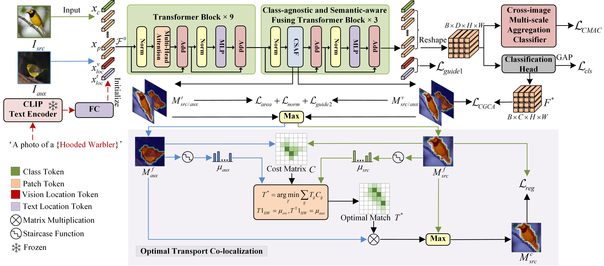
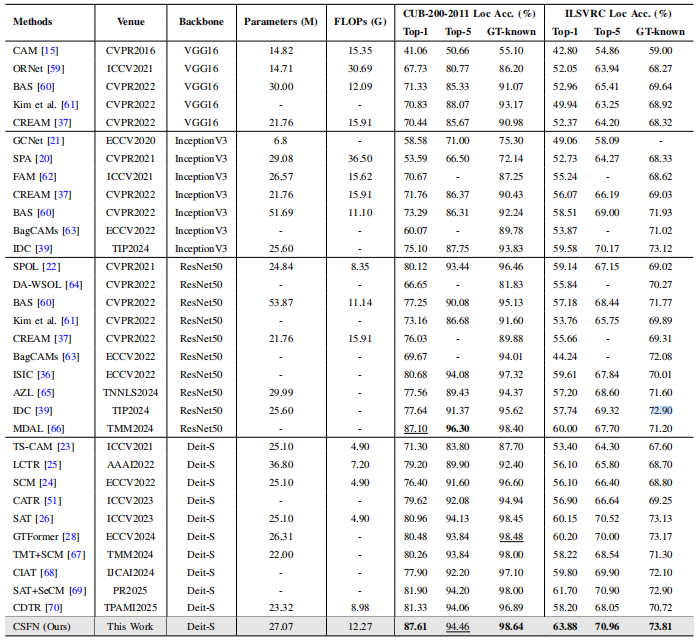

# "Class-agnostic and Semantic-aware Fusing Network with Optimal Transport for Weakly Supervised Object Localization" has been submitted to IEEE Transactions on Multimedia.

PyTorch implementation of ''Class-agnostic and Semantic-aware Fusing Network with Optimal Transport for Weakly Supervised Object Localization''. This repository contains PyTorch training code, inference code and pretrained models. 


## Paper Link <a name="1"></a> 

* Class-agnostic and Semantic-aware Fusing Network with Optimal Transport for Weakly Supervised Object Localization

    Authors: Lei Ma, Hongbo Wen, Hanyu Hong, Fanman Meng, and Qingbo Wu

## Abstract <a name="2"></a> 
Weakly supervised object localization (WSOL) aims to localize objects by only using image-level labels, which has attracted increasing attention with its low annotation cost in computer vision field. Existing methods can be roughly categorized into two categories: the CNN-based methods and the transformer-based methods. Due to the limited receptive field, the CNN-based methods tend to capture the most discriminative foreground regions rather than the whole region of the objects. The transformer-based methods only focus on improving the quality of the object localization within a single input image, which typically ignore the contrastive cues from different images within a same category. In addition, the inherent semantic ambiguity of the language prompt-able localization methods can often lead to the visual confusion in the real-world application. To solve above issues, we propose a class-agnostic and semantic-aware fusing network with optimal transport for weakly supervised object localization. Specifically, we propose a class-agnostic and semantic-aware fusing transformer to alleviate the optimization conflicts between classification and localization tasks, and a class-agnostic guided semantic-aware localization loss to regulate the semantic-aware localization map generated from the language prompt, which can assist the semantic-aware localization map to alleviate the visual localization confusion. Moreover, benefiting from intra-class similarity like appearance and color, we propose an optimal transport co-localization module to propagate the activated regions across different images by establishing dense correspondences across semantically similar images. Finally, we propose a dual classifier enhanced localization module consisting of a cross-image multi-scale aggregation classifier and a classification head to improve the classification performance of images. Extensive experiments demonstrate that the proposed method achieves superior performance than existing state-of-the-art WSOL methods on CUB-200-2011 and ILSVRC datasets. Code and models are available at https://github.com/whb919168848/CSFN.


## Method <a name="4"></a> 

<p align="center">
     <br />
    <em> 
    </em>
</p>

**The overall framework of the proposed method CSFN.**


## Requirements  
  - python 3.8 
  - scipy 1.7.3
  - torch 1.11.0
  - torchvision 0.12.0
  - opencv-python 4.6.0.66
  - scikit-image 0.19.3
  - Pillow 9.2.0

## Usage <a name="6"></a> 


### Download Datasets <a name="62"></a> 

* CUB-200-2011 ([http://www.vision.caltech.edu/visipedia/CUB-200-2011.html](http://www.vision.caltech.edu/visipedia/CUB-200-2011.html))
* ILSVRC ([https://www.image-net.org/challenges/LSVRC/](https://www.image-net.org/challenges/LSVRC/))

### Training <a name="63"></a> 

For CUB:
```bash  
python train.py  
```

For ImageNet:
```bash  
python train_ImageNet.py
```

### Inference <a name="63"></a> 

To test the localization accuracy on CUB-200-2011, you can download the trained models from Model Zoo, then run `evaluator.py`:
```bash  
python evaluator.py  
```

To test the localization accuracy on ILSVRC, you can download the trained models from Model Zoo, then run `evaluator_ImageNet.py`:
```bash  
python evaluator_ImageNet.py 
```


## Experimental Results and Model Zoo <a name="7"></a> 
You can download the trained models as follows:


|              | Top1 Loc | Top5 Loc | GT Known |      Weights      |
|:------------:|:--------:|:--------:|:--------:|:-----------------:|
| CUB-200-2011 |  87.61   |  94.46   |  98.64   | [Baidu Drive]( )  |
|    ILSVRC    |  63.88   |  70.96   |  73.81   | [Baidu Drive]( ) |


## Experimental Results <a name="8"></a> 

<p align="center">
     <br />
    <em> 
    </em>
</p>

<p align="center">
     <br />
    <em> 
    </em>
</p>

## Visualization Results
<p align="center">
     <br />
    <em> 
    </em>
</p>

**CAM visualization results.**  Localization visualization results all samples of CUB-200-2011 test dataset in the class “American Redstart”. More results have been shown in "imgs" file.

## Acknowledgements

Many thanks to [SAT (ICCV2023)](https://github.com/wpy1999/SAT).


